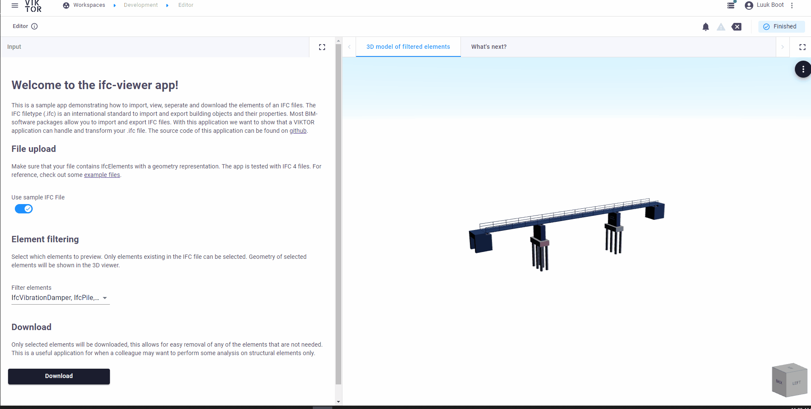
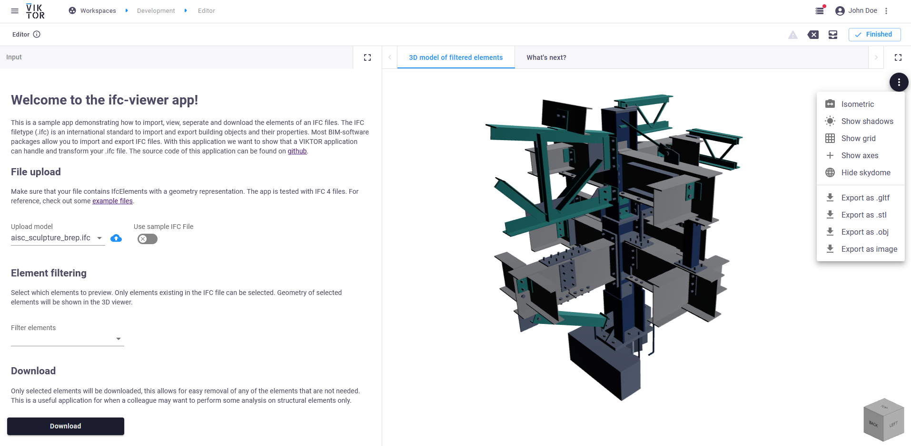

 <Please check version is the same as specified in requirements.txt>

# ifc-viewer
This sample app demonstrates how to import, view and transform IFC files, see an animation of the VIKTOR application below.
You can access the app right now, using this [link!](https://demo.viktor.ai/public/ifc-viewer)

The IFC filetype (.ifc) is an international standard to import and export building objects and their properties. 
Most BIM-software packages allow you to import and export IFC files. With this application we want to show how to handle IFC files in a Viktor application.

## File upload
The file upload size is now capped at 45mb. This can be adjusted by the developer. Make sure that your file contains 
IfcElements with a geometry representation. The app is tested with IFC 4 files. For example file used is based on this Autodesk Revit model:
https://revit.downloads.autodesk.com/download/2024RVT_RTM/Docs/InProd/racadvancedsampleproject.rvt

## Element filtering
Select which elements to preview. Only elements existing in the IFC file can be selected. Geometry of selected elements 
will be shown in the 3D viewer. 

## View
Click update to refresh the view. Click the elipsis (...) to export to other file formats, or download an image.

## Download
A filtered IFC file can be downloaded, with the result being a downloaded file with all the elements that were not 
selected removed.

# App structure 
This is an editor-only app type.

